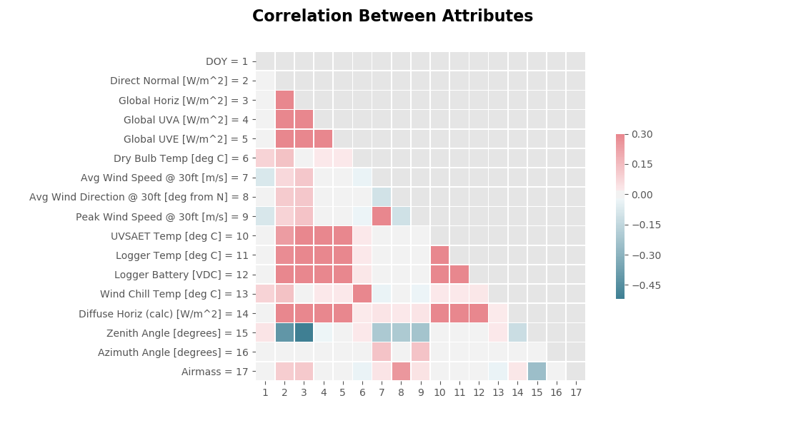
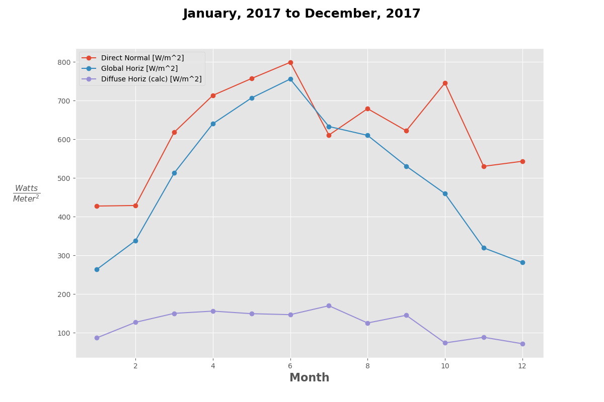
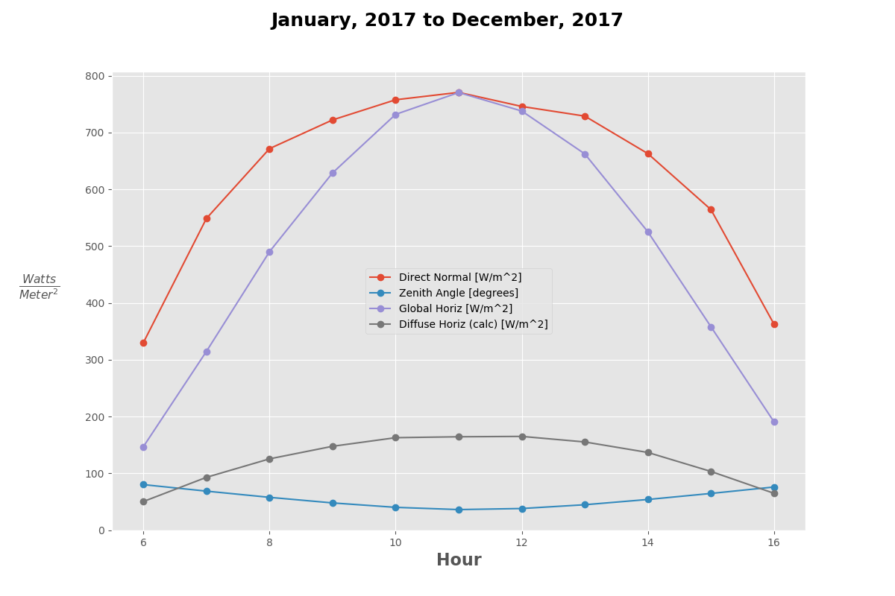
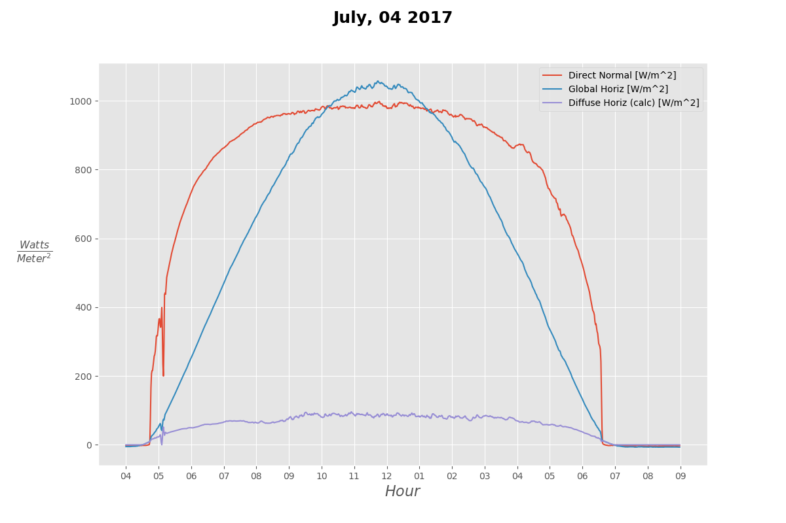
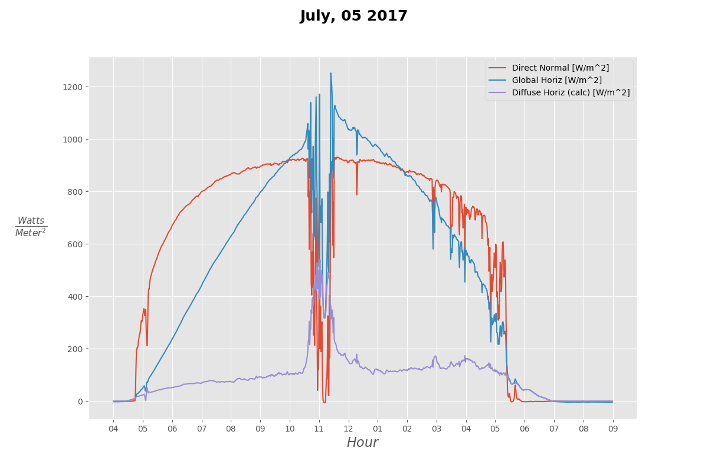
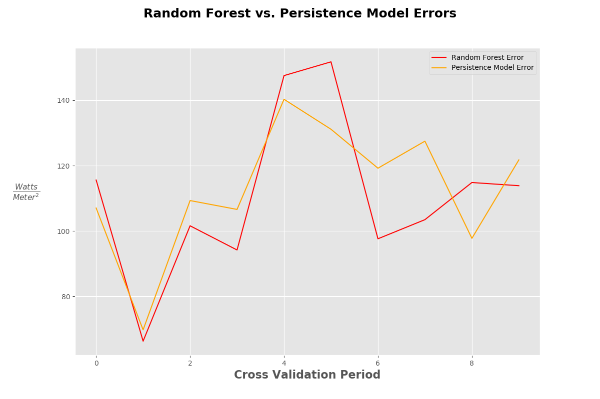

# Predicting Direct Normal Irradiance (DNI)

### Background

While Photovoltaic (PV) power plants were the first form of solar powered energy to be implemented across the globe, Concentrated Solar Power, otherwise known as CSP, has seen a rise in deployment in recent years.

173,000 Heliostats focus the Sun's energy on thee Power Tower's at Ivanpah Solar Electric in California.

In contrast to PV power plants, CSP technology has the ability to efficiently and inexpensively store the Sun's energy in the form of high temperature fluid (usually molten salt, however [new research](https://www.energy.gov/sites/prod/files/2016/08/f33/05-Ho_falling_particle_receiver_CSPSummit2016_0.pdf) is experimenting with other particles), which can be used to power a turbine when the the Sun isn't shining, given enough storage.

### Data Preview

The weather station from which I obtained the data is located at 36.06°N, 115.08°W, which is roughly 65.96 km from Ivanpah (35.56°N, 115.47°W). While this distance is not inconsequential, my though process is that should my model prove useful, it could be deployed at the plant using their data.

The data I used has meteorological measurements every minute from March 3, 2006 up to April 13, 2018 (one day prior to download), equating to slightly over six million observations. Variables include Zenith Angle, Azimuth Angle, Day of the Year (DOY), along with various other measurements.

While there are a number of features that could provide additional predictive power, it is worth noting that the amount of information contained in only the DOY, Time, Zenith and Azimuth angle, as well as (implicit) latitude/longitude is rather high.

### The Problem

Knowing how much energy a plant will be able to produce is clearly highly dependent on the amount of DNI (measured in $\frac{Watts}{Meter^2}$ here) the heliostats receive, which, as we will see below, is highly irregular.

The goal of this analysis will be to see how accurately different models are able to predict DNI 15 minutes into the future from any given minute during the day.

| Time Stamp  | DNI | DNI 15 Minutes from Now
| ------------- | ------------- | ------------- |
| 2015-06-11 11:00:00 | 889.945 | **892.412**
| 2015-06-11 11:01:00 | 891.852 | **892.833**
| 2015-06-11 11:02:00 | 893.199 | **893.499**
| 2015-06-11 11:03:00 | 892.430 | **892.421**
| 2015-06-11 11:04:00 | 890.426 | **892.787**
| 2015-06-11 11:05:00 | 890.070 | **893.600**
| 2015-06-11 11:06:00 | 890.360 | **895.570**
| 2015-06-11 11:15:00 | **892.412** | 896.047
| 2015-06-11 11:16:00 | **892.833** | 898.870
| 2015-06-11 11:17:00 | **893.499** | 900.519
| 2015-06-11 11:18:00 | **892.421** | 901.682
| 2015-06-11 11:19:00 | **892.787** | 898.668
| 2015-06-11 11:20:00 | **893.600** | 896.846
| 2015-06-11 11:21:00 | **895.570** | 898.221

### Feature Engineering

In addition to creating my target variables as shown above, for each observation I 15 new variables, with the DNI measurement of the timestamp *t* minutes back. (i.e for observation *i*, the variable named DNI_T_minus2 would be the time would be the DNI measurement of observation *i - 2*)

### EDA

### My Base Model vs The Benchmark

According to a [2013 article ](https://ac-els-cdn-com.www2.lib.ku.edu/S1364032113004334/1-s2.0-S1364032113004334-main.pdf?_tid=41f83cfe-de21-4d94-803f-a7470d8e51df&acdnat=1523992118_8198b37af15a4d0e24f139dfcd721a9d) that reviewed the current statistical models used to predict global irradiance, the benchmark model, called the *Persistence Model*, predicts that irradiance at time step $t$ is equal to irradiance at time step $t-1$. That is to say,

$$\hat{y_{t}} = y_{t-1}$$

I decided to use a Random Forest Regressor as my base model to compare against this benchmark. Using Scikit-Learn defaults, the errors for the Random Forest Regressor as well as the Persistence Model are show below. The Random Forest was trained over a 90 day period and then tested on the 30 days immediately thereafter.

| Train Start  | Train End | Test Start | Test End | Test RMSE | Persistence Model RMSE |
| ------------- | ------------- | ------------- | ------------- | ------------- | ------------- |
0  2014-06-12 | 2014-09-10 | 2014-09-11 | 2014-10-11 | 115.591173 | 107.016514
1  2012-02-19 | 2012-05-19 | 2012-05-20 | 2012-06-19 | 66.310551 | 69.769965
2  2010-09-08 | 2010-12-07 | 2010-12-08 | 2011-01-07 | 101.588658 | 109.306903
3  2014-10-21 | 2015-01-19 | 2015-01-20 | 2015-02-19 | 94.189279 | 106.596711
4  2015-03-14 | 2015-06-12 | 2015-06-13 | 2015-07-13 | 147.521541 | 140.283792
5  2009-11-11 | 2010-02-09 | 2010-02-10 | 2010-03-12 | 151.730660 | 131.118673
6  2011-10-09 | 2012-01-07 | 2012-01-08 | 2012-02-07 | 97.613848 | 119.203864
7  2008-10-15 | 2009-01-13 | 2009-01-14 | 2009-02-13 | 103.462630 | 127.478184
8  2007-12-28 | 2008-03-27 | 2008-03-28 | 2008-04-27 | 114.826339 | 97.758155
9  2011-05-23 | 2011-08-21 | 2011-08-22 | 2011-09-21 | 113.852410 | 121.753249

*(It is notable that I performed cross-validation using various random seeds, there were some test periods where there was a drastic difference between the random forest classifier and the base model. This would require further exploration to deem causation.)*

### Neural Networks

A MLP was developed to predict irradiance 24 hours in advance for PV plant in Italy ([article](https://ac-els-cdn-com.www2.lib.ku.edu/S0038092X10000782/1-s2.0-S0038092X10000782-main.pdf?_tid=85616b05-995e-48d0-bfa8-9fd7fae6cf27&acdnat=1523992062_3fc582bfafa044fee8fcabd7275d202b)). This MLP accepted as input mean daily irradiance and mean daily air temperature, which resulted in a "...correlation coefficient of more than 98% for sunny days and slightly less than 95% for cloudy days."[$^{[1]}$](https://ac-els-cdn-com.www2.lib.ku.edu/S0038092X10000782/1-s2.0-S0038092X10000782-main.pdf?_tid=85616b05-995e-48d0-bfa8-9fd7fae6cf27&acdnat=1523992062_3fc582bfafa044fee8fcabd7275d202b)

< insert super cool, industry changing model here >

Acknowledgements:

* Data Source: [Andreas, A.; Stoffel, T.; (2006). University of Nevada (UNLV):
Las Vegas, Nevada (Data); NREL Report No. DA-5500-56509.](http://dx.doi.org/10.5439/1052548) (Data downloaded April 14, 2018)
