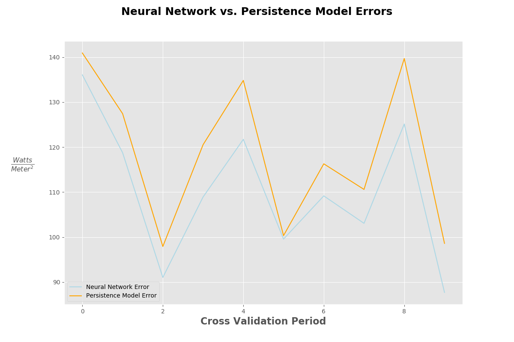

# Predicting Direct Normal Irradiance (DNI)

### Table of Contents

1. [Background](#background)
2. [Data Preview](#data-preview)
3. [The Problem](#the-problem)
    + [Goal of Analysis](#goal)
4. [EDA](#eda)
5. [Feature Engineering](#feature-engineering)
6. [Base Model vs Benchmark](#my-base-model-vs-the-benchmark)
7. [Neural Network](#neural-network)
    + [Results](#mlp-results)

### Background

While Photovoltaic (PV) power plants were the first form of solar powered energy to be implemented across the globe, Concentrated Solar Power, otherwise known as CSP, has seen a rise in deployment in recent years.

173,000 Heliostats focus the Sun's energy on thee Power Tower's at Ivanpah Solar Electric in California.

In contrast to PV power plants, CSP technology has the ability to efficiently and inexpensively store the Sun's energy in the form of high temperature fluid (usually molten salt, however [new research](https://www.energy.gov/sites/prod/files/2016/08/f33/05-Ho_falling_particle_receiver_CSPSummit2016_0.pdf) is experimenting with other particles), which can be used to power a turbine when the the Sun isn't shining, given enough storage.

### Data Preview

The weather station from which I obtained the data is located at 36.06°N, 115.08°W, which is roughly 65.96 km from Ivanpah (35.56°N, 115.47°W). While this distance is not inconsequential, my though process is that should my model prove useful, it could be deployed at the plant using their data.

The data I used has meteorological measurements every minute from March 3, 2006 up to April 13, 2018 (minus the latter half of 2013, where data wasn't available, reason unkown), equating to slightly over six million observations. Variables include Zenith Angle, Azimuth Angle, Day of the Year (DOY), along with various other measurements.

While there are a number of features that could provide incremental predictive power, it is worth noting that the amount of information contained in only the DOY, Time, Zenith and Azimuth angle, as well as (implicit) latitude/longitude is relatively high.

A sample of the data is shown below, with most attributes excluded for the sake of brevity.

| Year | DOY | Direct Normal [W/m^2] | Zenith Angle [degrees] | Azimuth Angle [degrees]
| ------------- | ------------- | ------------- | ------------- | ------------- |
| 2018 | 103 | 402.520 | 48.2098 | 112.655 |
| 2018 | 103 | 407.815 | 48.0227 | 112.871 |
| 2018 | 103 | 416.707 | 47.8368 | 113.089 |
| 2018 | 103 | 433.760 | 47.6512 | 113.309 |
| 2018 | 103 | 433.649 | 47.4659 | 113.529 |

### The Problem

How much energy a solar plant will be able to produce is clearly a function of the amount of DNI (measured in Watts per Meter Squared here) the heliostats receive. When the solar plants are communicating with electricity providers, who are on the hook to provide electricity regardless of what plant it comes from, it is important that they are able to give accurate estimates of how much energy they will be able to provide at a given time.

Since DNI is the source of energy for these plants, *being able to predict the energy they will be able to provide is correlated with being able to predict the DNI their plant receives,* which brings us to the goal of the this analysis.

####  Goal

The goal of this analysis will be to predict Direct Normal Irradiance, measured in Watts per Meter Squared, 15 minutes into the future.

To create this target variable, I shifted the current DNI back 15 minutes and added that as a new attribute (note that this means that last 15 minutes of the data set will have zeroes in this column.)

| Time Stamp  | DNI | DNI 15 Minutes from Now
| ------------- | ------------- | ------------- |
| 2015-06-11 11:00:00 | 889.945 | **892.412**
| 2015-06-11 11:01:00 | 891.852 | **892.833**
| 2015-06-11 11:02:00 | 893.199 | **893.499**
| 2015-06-11 11:03:00 | 892.430 | **892.421**
| 2015-06-11 11:04:00 | 890.426 | **892.787**
| 2015-06-11 11:05:00 | 890.070 | **893.600**
| 2015-06-11 11:06:00 | 890.360 | **895.570**
| 2015-06-11 11:15:00 | **892.412** | 896.047
| 2015-06-11 11:16:00 | **892.833** | 898.870
| 2015-06-11 11:17:00 | **893.499** | 900.519
| 2015-06-11 11:18:00 | **892.421** | 901.682
| 2015-06-11 11:19:00 | **892.787** | 898.668
| 2015-06-11 11:20:00 | **893.600** | 896.846
| 2015-06-11 11:21:00 | **895.570** | 898.221

### EDA

In the correlation plot below, there are a few variables that at first glance seem highly correlated, however it is important to note that the values only range from -0.48 to 0.3

As one would expect, the months with the highest average DNI are in the summer months (although I have yet to do an analysis on a power plant in the Souther Hemisphere, it is reasonable to assume that this plot would be the mirror image of itself.)

In the plot below, we can see the general trend of DNI during the daytime, which as expected is highest midday (when the sun is as close to being "directly overhead" as possible.)

While some days almost exactly replicate the average shown above, like July 4 of 2017...

...others (most) are far more variable.

### Feature Engineering

In the same vein as creating the target variable shown previously, for each observation, I created 15 new variables, with the DNI measurement of the timestamp *t* minutes back. (i.e for observation *i* at timestamp *x*, the variable named DNI_T_minus2 would be the DNI measurement of observation *i - 2* at timestamp *x - 2*)

**This allows the information that relates the recent past to the present and future to be contained when the observations are randomized during cross validation.**

In addition to these 15 manufactured variables, I included DNI at the current timestamp, the year, month, DOY, time (broken into two columns, hour and minute), Zenith Angle and Azimuth Angle (both measured in degrees) and Airmass in my model. This come out to 24 total predictors.

### Base Model vs Benchmark

According to an article published in 2013 (Acknowledgement 3) that reviewed the current statistical models used to predict global irradiance, the benchmark model, called the *Persistence Model*, predicts that irradiance at time step $t$ is equal to irradiance at time step $t-1$. That is to say,

I decided to use a Random Forest Regressor as *my* base model to compare against this benchmark. Using Scikit-Learn defaults, the errors for the Random Forest Regressor as well as the Persistence Model are show below. The Random Forest was trained over a 90 day period and then tested on the 30 days immediately thereafter.

| Train Start  | Train End | Test Start | Test End | Test RMSE | Persistence Model RMSE |
| ------------- | ------------- | ------------- | ------------- | ------------- | ------------- |
0  2014-06-12 | 2014-09-10 | 2014-09-11 | 2014-10-11 | 115.591173 | 107.016514
1  2012-02-19 | 2012-05-19 | 2012-05-20 | 2012-06-19 | 66.310551 | 69.769965
2  2010-09-08 | 2010-12-07 | 2010-12-08 | 2011-01-07 | 101.588658 | 109.306903
3  2014-10-21 | 2015-01-19 | 2015-01-20 | 2015-02-19 | 94.189279 | 106.596711
4  2015-03-14 | 2015-06-12 | 2015-06-13 | 2015-07-13 | 147.521541 | 140.283792
5  2009-11-11 | 2010-02-09 | 2010-02-10 | 2010-03-12 | 151.730660 | 131.118673
6  2011-10-09 | 2012-01-07 | 2012-01-08 | 2012-02-07 | 97.613848 | 119.203864
7  2008-10-15 | 2009-01-13 | 2009-01-14 | 2009-02-13 | 103.462630 | 127.478184
8  2007-12-28 | 2008-03-27 | 2008-03-28 | 2008-04-27 | 114.826339 | 97.758155
9  2011-05-23 | 2011-08-21 | 2011-08-22 | 2011-09-21 | 113.852410 | 121.753249

*(It is notable that I performed cross-validation using various random seeds, there were some test periods where there was a drastic difference between the random forest classifier and the base model. This would require further exploration to deem causation.)*

While the model isn't much worse than the benchmark, it isn't considerably better. In an effort to move the error of my model below the benchmark, I decided to implement a Neural Network.

### Neural Network

A Multi Layer Perceptron (MLP) was developed a few years ago to predict irradiance 24 hours in advance for PV plant in Italy (Acknowledgement 2). This MLP accepted as input mean daily irradiance and mean daily air temperature. While the authors of this article were predicting irradiance further in advance than I am for this analysis, I decided to use the framework of their MLP as a starting point.

They had two hidden layers, with 11 and 17 neurons, respectively. While their model only had two inputs (mean daily solar irradiance and air temperature), I used the same number of predictors that were used in the Random Forest Regressor above

After doing some manual grid searching with various epochs and and different numbers of nodes in each hidden layer, I ended up with 8 neurons in the first hidden layer and 12 in the second. I trained my data over 5 epochs, with a batch size of 250.

This model was trained in the same manner that the Random Forest Regressor was trained (90 days used to train and 30 days used to test). Since Keras' implementation of MLP's does perform cross validation within itself, the testing part of *my* function provides additional testing error information, displayed below.

#### MLP Results

### Next Steps

* Experiment with a broader and more formal grid search for the MLP (more variables, longer training time, etc.)
* Forecast DNI further into the future (15 minute increments up to 1-2 hours)
* See if a LSTM outperforms my optimized MLP
* Bring in data from other locations (lat/long)
    * see if current model performs as well across geographic locations
* **MVP+++ Bring error down to be consistently below 100 w/m^2**

Acknowledgements:

1. Data Source: [Andreas, A.; Stoffel, T.; (2006). University of Nevada (UNLV):
Las Vegas, Nevada (Data); NREL Report No. DA-5500-56509.](http://dx.doi.org/10.5439/1052548) (Data downloaded April 14, 2018)

2. [A 24-h forecast of solar irradiance using artificial neural network: Application for performance prediction of aa grid-connected PV plant at Triest, Italy.](https://ac-els-cdn-com.www2.lib.ku.edu/S0038092X10000782/1-s2.0-S0038092X10000782-main.pdf?_tid=85616b05-995e-48d0-bfa8-9fd7fae6cf27&acdnat=1523992062_3fc582bfafa044fee8fcabd7275d202b)

3. [Review of solar irradiance forecasting methods and a proposition for small-scale insular grids](https://ac-els-cdn-com.www2.lib.ku.edu/S1364032113004334/1-s2.0-S1364032113004334-main.pdf?_tid=41f83cfe-de21-4d94-803f-a7470d8e51df&acdnat=1523992118_8198b37af15a4d0e24f139dfcd721a9d)
