# Predicting Direct Normal Irradiance (DNI)

##### Table of Contents

1. [Background](#background)
2. [The Problem](#the-problem)
3. [Data Preview](#data-overview)
4. [EDA](#exploring-the-data)
5. [Feature Engineering](#feature-engineering)
6. [Modeling](#modeling)
    + [Results](#results)
7. [Going Further](#going-further)
8. [Next Steps](#next-steps)

## Background

While Photovoltaic (PV) power plants were the first form of solar powered energy to be implemented across the globe, Concentrated Solar Power, otherwise known as CSP, has seen a rise in deployment in recent years.

173,000 Heliostats focus the Sun's energy on thee Power Tower's at Ivanpah Solar Electric in California.

In contrast to PV power plants, CSP technology has the ability to efficiently and inexpensively store the Sun's energy in the form of high temperature fluid (usually molten salt, however [new research](https://www.energy.gov/sites/prod/files/2016/08/f33/05-Ho_falling_particle_receiver_CSPSummit2016_0.pdf) is experimenting with other particles), which can be used to power a turbine when the the Sun isn't shining, given enough storage.

## The Problem

How much energy a solar plant will be able to produce is clearly a function of the amount of DNI (Direct Normal Irradiance, measured in Watts per Meter Squared here) the heliostats receive. When the solar plants are communicating with electricity providers, who are on the hook to provide electricity regardless of what plant it comes from, it is important that they are able to give accurate estimates of how much energy they will be able to provide at a given time.

Since DNI is the source of energy for these plants, *being able to predict the energy they will be able to provide is directly related to the DNI their plant receives,* which brings us to the goal of the this analysis; **predict DNI 30 minutes in the future.**

To create this target feature, I shifted the value of DNI back one time step, illustrated below.

## Data Overview

The data I used for this project was obtained using the API from the National Solar Radiation Database ([NSRDB](https://nsrdb.nrel.gov/)). The data I gathered has measurements of various atmospheric variables for every half hour, every day, going back to 2003. This amount to 48 measurements per day, per year, for a total of 245,472 observations. A sample of the data is shown below, with most attributes excluded for the sake of brevity.

| Timestamp | DNI | Relative Humidity | Solar Zenith Angle | Wind Speed |
| - | - | - | - | - | - | - |
| 2003-01-01 08:00:00 | 617 | 53.51 | 79.17 | 7.5 |
| 2003-01-01 08:30:00 | 725 | 49.94 | 74.59 | 7.4 |
| 2003-01-01 09:00:00 | 794 | 46.07 | 70.43 | 7.4 |
| 2003-01-01 09:30:00 | 842 | 46.06 | 66.75 | 7.2 |
| 2003-01-01 10:00:00 | 888 | 40.08 | 63.65 | 7.0 |

While there are a number of stochastic features such as Relative Humidity, Cloud Type and Wind Speed, it is worth noting that there is a lot of implicit information in the day of the year (DOY), time and latitude/Longitude. Holding latitude, longitude and time of day constant, The DNI that hits the **outside** of the earth's atmosphere will be the same from year to year.

## Exploring the Data

With a quick heatmap of the correlation between attributes, it is clear to see that there is very little collinearity in the data. The only noticeable correlation is negative, between the Solar Zenith Angle and the various Irradiance attributes.

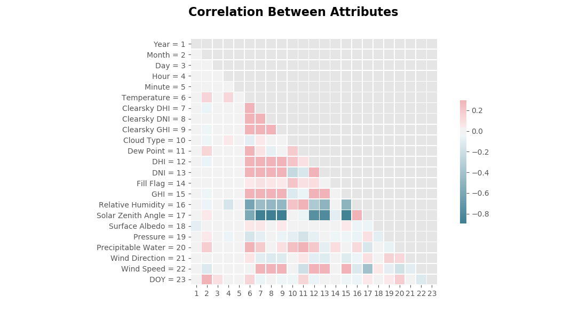

No real surprises with this negative correlation, since as the Sun's angle from directly overhead increases, there is less direct light on a given point.

### Example Days

Although DNI in summer tends to be a little more predictable, it is important that a model is able to predict DNI accurately for any time of the year. Speaking to variance in weather, In the plot for July 4, 2016 below, Cloud Type was a consistent zero for all timestamps. However, for December 5, 2016, there is clearly a lot more variance in the atmosphere, shown in the table below.

| Timestamp | Cloud Type | Timestamp (cont't) | Cloud Type |
| - | - | - | - |
| 00:00:00 |  1.0 | 03:00:00 |  4.0 |
| 00:30:00 |  8.0 | 03:30:00 |  8.0 |
| 01:00:00 |  8.0 | 04:00:00 |  8.0 |
| 01:30:00 |  8.0 | 04:30:00 |  4.0 |
| 02:00:00 |  8.0 | 05:00:00 |  8.0 |
| 02:30:00 |  3.0 | 05:30:00 |  0.0 |

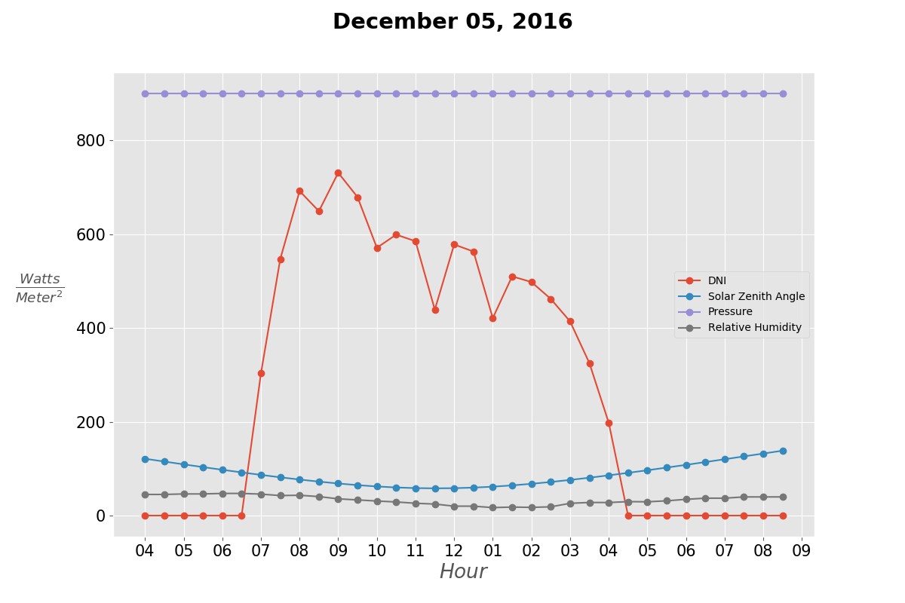

## Feature Engineering

In the same vein as creating the target variable shown previously, for all the atmospheric variables in the data set, I created features that 'look back' 30, 60, 90 and 120 minutes (4 timestamps), illustrated below.

**This allows the sequential aspect of the data to be maintained while creating independence among the observations**

## Modeling

According to an article published in 2013 (Acknowledgement 3) that reviewed the current statistical models used to predict global irradiance, the "model to beat" (benchmark) is called the *Persistence Model*. The Persistence Model, as the name implies, predicts that irradiance persists from time *T* to time *T + 1*. That is to say

A Multi Layer Perceptron (MLP) was developed a few years ago to predict irradiance 24 hours in advance with 11 and 17 hidden layer nodes, respectively. I used this architecture as a starting point and after some grid searching ended up with 10 nodes in the first hidden layer and 40 in the second, with 38 epochs and a batch size of 17. In addition to the MLP, I trained a Random Forest Regressor with scikit learn defaults, to test if a less intelligent model would beat the benchmark as well

#### Results

Both the Random Forest and the MLP were able to beat the Persistence Model with respect to both RMSE and MAE across all months in the dataset, shown in the two graphs below. Although both models perform similarly, the MLP does have a slight edge on the Random Forest, most noticeably in the later months of the year.

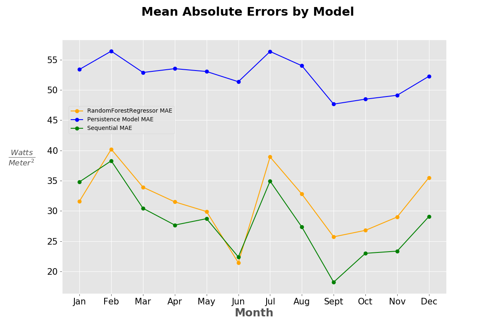

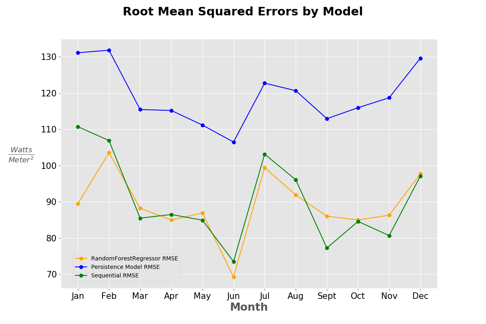

## Going Further

One thing I was curious about was whether predicting further into the future would have a drastic shift in the errors, both MAE and RMSE, of the Neural Network.

### Mean Absolute Errors as Time Increases

Looking at the below 4 plots, you can see that while there is a slight shift up in the Mean Absolute Errors, it doesn't go up by much. Interestingly, as one would imagine, the persistence model gets progressively worse as I predicted further into the future. This goes to show that there is more to be gained from using my model as DNI is predicted further into the future.

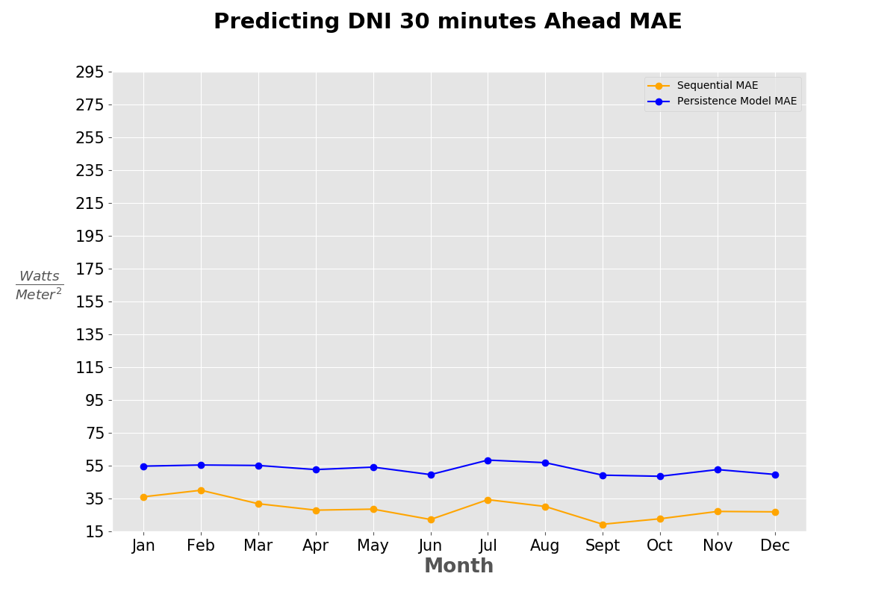

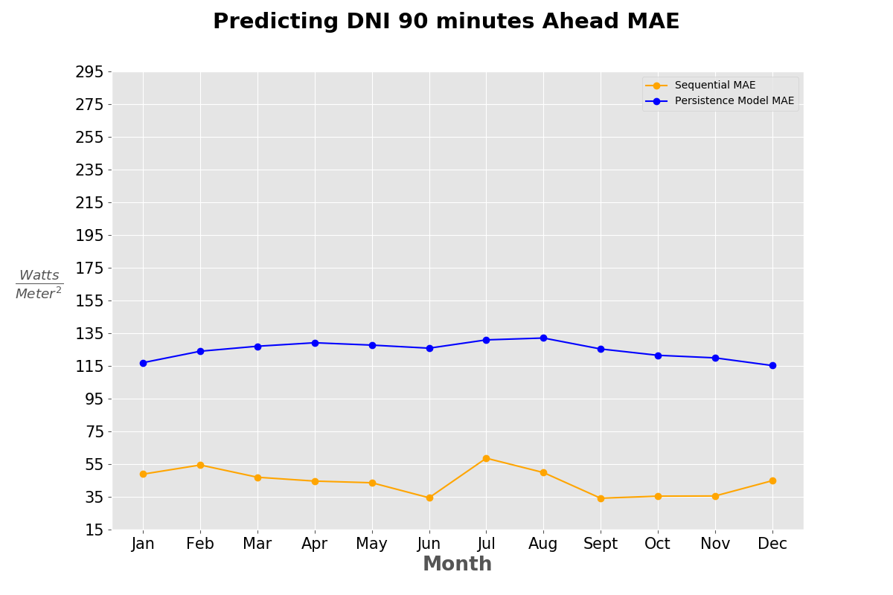
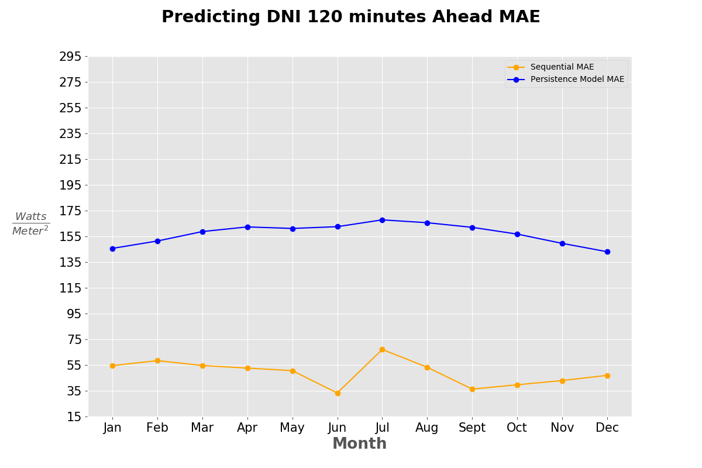

### Root Mean Squared Errors as Time Increases

The same pattern, slight fluctuations in the error rate as DNI is predicted further into the future can be seen with respect to RMSE, and once again, the gap between my model and the benchmark widens as we look further into the future.

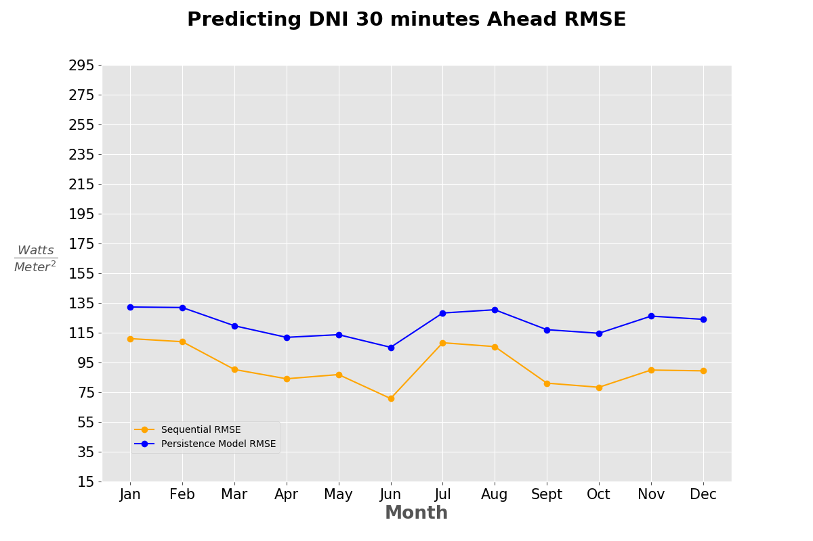
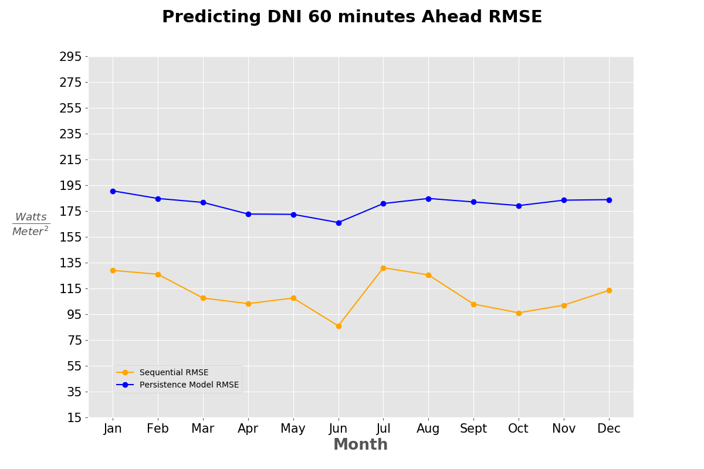
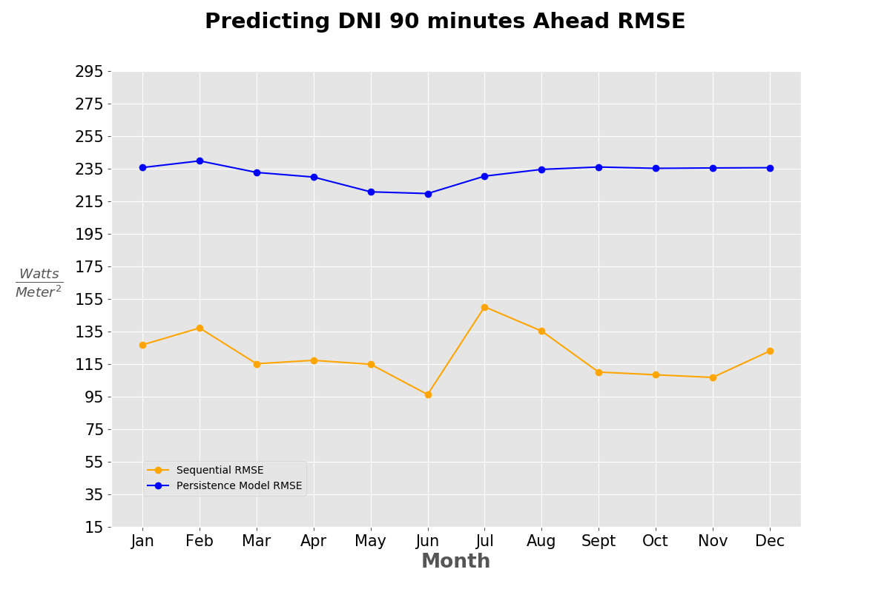
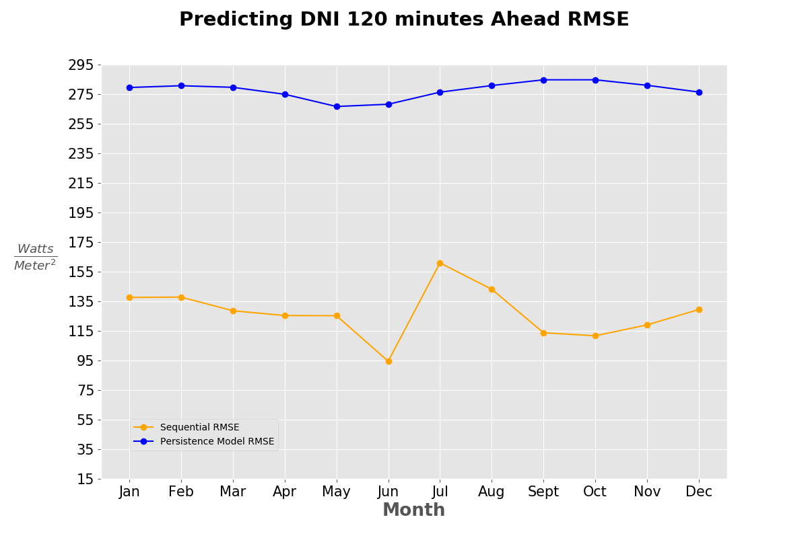

### Next Steps

* See if a LSTM outperforms my optimized MLP
* Bring in data from other locations (lat/long)
    * create a model for a user inputted latitude and longitude

Acknowledgements:

1. Data Source: [National Solar Radiation Database (NSRDB)](https://nsrdb.nrel.gov/)

2. [A 24-h forecast of solar irradiance using artificial neural network: Application for performance prediction of aa grid-connected PV plant at Triest, Italy.](https://ac-els-cdn-com.www2.lib.ku.edu/S0038092X10000782/1-s2.0-S0038092X10000782-main.pdf?_tid=85616b05-995e-48d0-bfa8-9fd7fae6cf27&acdnat=1523992062_3fc582bfafa044fee8fcabd7275d202b)

3. [Review of solar irradiance forecasting methods and a proposition for small-scale insular grids](https://ac-els-cdn-com.www2.lib.ku.edu/S1364032113004334/1-s2.0-S1364032113004334-main.pdf?_tid=41f83cfe-de21-4d94-803f-a7470d8e51df&acdnat=1523992118_8198b37af15a4d0e24f139dfcd721a9d)
