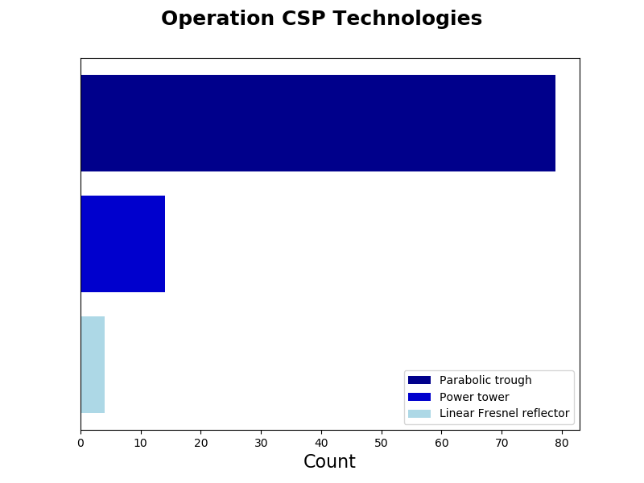
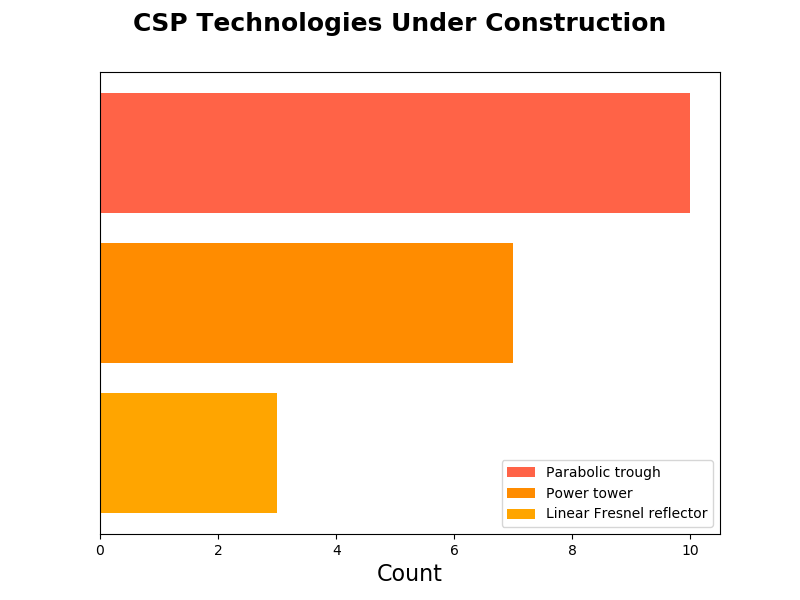
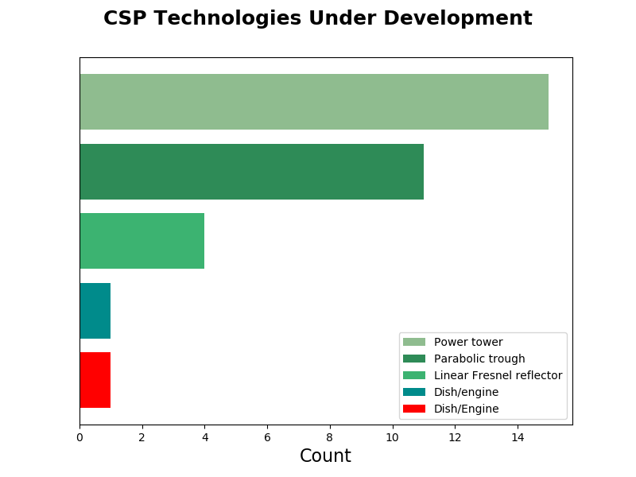

## Solar Industry

* Use google's geographical API to get latitude and longitude of Nan values in data set.

### For all solar power plant locations (preferably in world, will start with USA)...

##### MVP

Use weather (temp, cloud cover), time (30 min. intervals) and location (latitude, longitude, altitude) data to predict DNI.

    * Compare all complex models (I want to train random forests, boosting and a regression Neural Network) against multiple linear regression

##### MVP+

Forecast DNI X days out (with confidence intervals)

* Find minimum DNI needed for plant to be viable running

* Use NREL's API to plot DNI over time per location

* Determine what time of day plant should "turn off"

* use weather data to predict DNI with confidence

